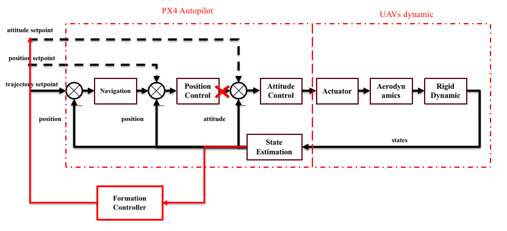
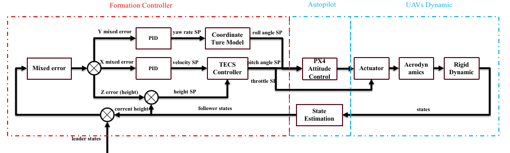

# Fixed-Wing UAV Formation Controller Design and Implementation

**Download my bachalor's [thesis](./demo_files/main.pdf).**

> **Flight Simulation based on Gazebo & ROS:**

## Introduction & Hypothesis

### Introduction

Use the “Leader-Follower” method to accomplish the 2 fixed-wing UAVs formation controlling.

### Software Architecture

### Hypothesis

- Earth
  - No rotation, inertial coordinate system
  - Flat, no curve
- Air
  - No wind
  - The air shares the same properties within the UAVs flight envelope.
- UAVs
  - Not sliding( sliding angle β=0), Coordinated Turn Model
  - AOA(angle of attack) is small
  - Rigid body

## Modeling

### Horizontal Plane

- Split this problem into horizontal plane and vertical plane!
- The formation control object:
  - Velocity of the follower is the same as the leader.
  - Position error is zero

**Note:** no sliding angle, no wind and  small AOA, velocity is (almost) along the body-fixed axis X.

### Vertical Plane

- In the vertical plane, the most important error is the height error, which is also called the Z position error.

**Note:** We mainly focus on the horizonal plane motion.  So, we won’t take it as a part of error in the vertical plane.

## Formation Controller Design

- Make use of the inner-loop controller, design the outer-loop!
- Input: the states of leader and follower.
- Output: the desired attitude setpoint and the throttle values of the follower.

### Error Defination

- Why? Find the relationship between the errors and their corresponding controllable variables:
- X direction ==> velocity.
- Y direction ==> yaw rate.
- Z direction ==> height
- We want to eliminate both the position and velocity error at the same time!
- So, We define the linear combination of the position and velocity error as the “mixed error” along the X and Y axis in
  follower’s body-fixed coordinate system.
- We will use the height error as the error along the Z axis, treating the main motion as in the 2D plane.

## Simulation Results

## Copyright

**Copyright (C) 2020 Aircraft Dynamics and Control Laboratory of BIT. All rights reserved.**
